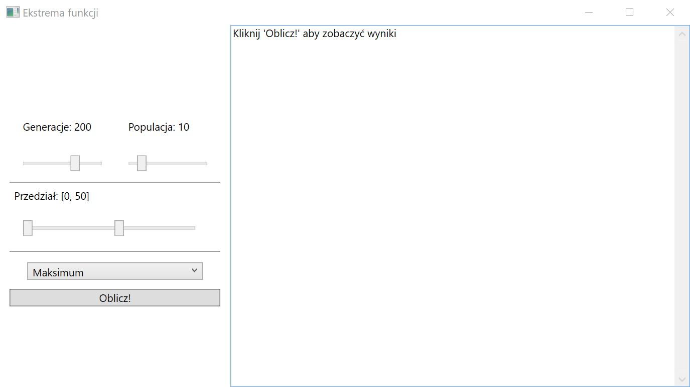

# Ekstrema-Funkcji
## Opis programu
Wykorzystujac algorytm genetyczny program wyznacza maksimum lub minimum funkcji f w
zadanym przedziale.  

## Instrukcja obsługi
Po uruchomieniu aplikacji w lewej stronie okienka znajduja sie suwaki, za pomoca których
mozna ustawic parametry algorytmu (ilosc generacji, populacji oraz przedział w którym szukane
bedzie ekstremum). Pod suwakami znajduje sie lista, z której mozna wybrac które
ekstremum chcemy policzyc. Po przycisnieciu przycisku „Oblicz!” po lewej stronie pojawia
sie wyniki dla kazdej generacji.

